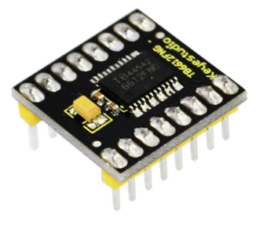
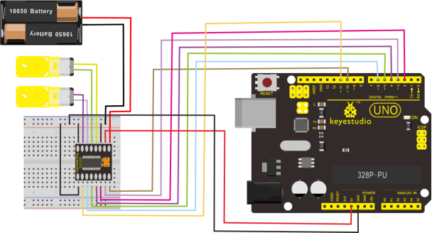

# KS0066 keyestudio TB6612FNG Motor Driver



## 1. Introduction

The TB6612FNG motor driver can control up to two DC motors at a constant current of 1.2A (3.2A peak).

Two input signals (IN1 and IN2) can be used to control the motor in one of four function modes - CW, CCW, short-brake, and stop.

The two motor outputs (A and B) can be separately controlled, the speed of each motor is controlled via a PWM input signal with a frequency up to 100kHz.

The STBY pin should be pulled high to take the motor out of standby mode. Logic supply voltage (VCC) can be in the range of DC 2.7-5.5V, while the motor supply (VM) is limited to a maximum voltage of 15V DC.

The output current is rated up to 1.2A per channel (or up to 3.2A for a short, single pulse).

## 2. Specification

- Power supply voltage: VM=15V max, VCC=2.7-5.5V
- Output current: Iout=1.2A(average) / 3.2A (peak)
- Standby control to save power
- CW/CCW/short brake/stop motor control modes
- Built-in thermal shutdown circuit and low voltage detecting circuit
- Filtering capacitors on both supply lines

## 3. Connection Diagram



## 4. Sample Code

Download code :  [Code](./Code.7z)

```c
int AIN1=2;
int AIN2=3;
int STBY=4;
int BIN1=5;
int BIN2=6;
int PWMA=10;// enable pin 1
int PWMB=11;// enable pin 2
// D2 and D3 as a set, D5 and D6 as a set
// D10 and D11 as enable pins for DC motors

void setup()
{
  int i;
  for (i=2;i<=6;i++) // Ardunio motor driver module
  pinMode(i,OUTPUT); // set digital pins 2,3,4,5,6 as output
  pinMode(10,OUTPUT);// set digital pins 10, 11 as output
  pinMode(11,OUTPUT);
}

void loop()
{
  // 2 DC motor rotate CW for 1S, and rotate CCW for 1S
  // rotate CW
   digitalWrite(STBY,HIGH);

   digitalWrite(AIN1,HIGH);
   digitalWrite(AIN2,LOW);
   analogWrite(PWMA,200);
   digitalWrite(BIN1,HIGH); 
   digitalWrite(BIN2,LOW);
   analogWrite(PWMB,200);
   delay(1000);
   // pause for 1S
   digitalWrite(STBY,LOW);
   delay(1000);
   // rotate CCW 
    digitalWrite(STBY,HIGH);
    digitalWrite(AIN1,LOW);
    digitalWrite(AIN2,HIGH);
    analogWrite(PWMA,100); 
    digitalWrite(BIN1,LOW);
    digitalWrite(BIN2,HIGH);
    analogWrite(PWMB,100); 
	delay(1000); 
    // pause for 1S
   digitalWrite(STBY,LOW);
   delay(1000);
}
```

